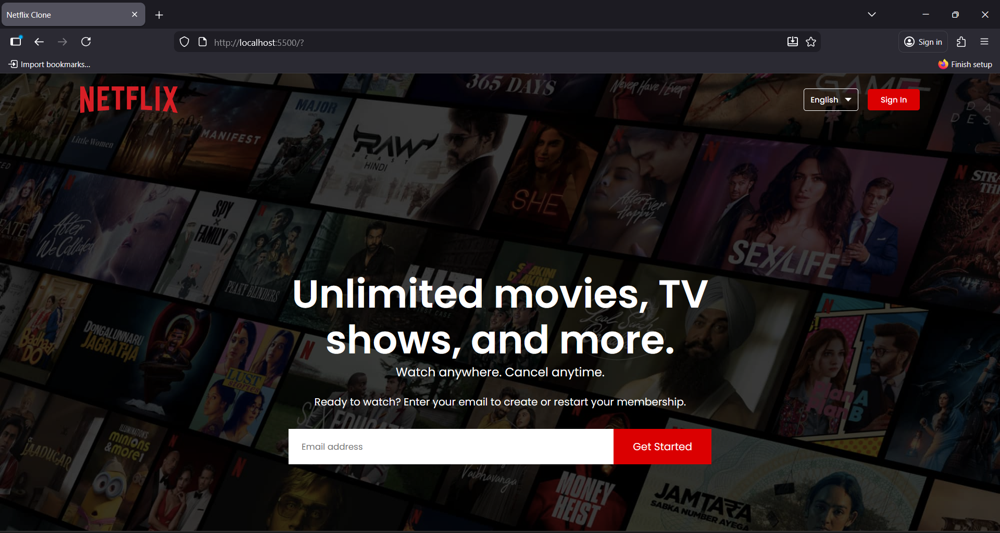

# Netflix Home Page Clone
<br>

## Preview



<br>

## 🚀 Live Demo

[**View the live project here!**](https://4f10fdf2.netflix-clone-cb4.pages.dev/)

<br>

## About The Project

This project is a pixel-perfect, responsive clone of the Netflix landing page, built exclusively with **HTML5** and **CSS3**. The primary goal was to demonstrate proficiency in core front-end technologies by recreating a complex, real-world UI without JavaScript.

Key learning objectives included:
- **Advanced CSS:** Implementing a JS-free interactive accordion using radio inputs and sibling selectors.
- **Responsive Design:** Ensuring a seamless experience across all devices using Flexbox and Media Queries.
- **Semantic HTML:** Structuring the page for accessibility and maintainability.

**Note:** This is a front-end showcase for educational purposes. It is not affiliated with Netflix and has no backend functionality.

## Key Features

- **Header Section**: A full-screen header with a background image, navigation bar, and a central call-to-action with an email signup form.
- **Feature Sections**: A series of sections highlighting key Netflix features, with alternating text and image layouts.
- **CSS-Only Accordion**: An interactive FAQ section built purely with HTML and CSS, demonstrating advanced selector and transition techniques.
- **Footer**: A comprehensive multi-column footer with links, mirroring the original site's design.

## Built With

- **HTML5**: For the semantic structure and content of the web page.
- **CSS3**: For all styling, including:
  - **Flexbox** for layout management.
  - **Media Queries** for responsive design.
  - **Transitions** for smooth animations in the FAQ accordion.
- **Google Fonts**: For the 'Poppins' font family.

## Getting Started

To get a local copy up and running, follow these simple steps.

### Prerequisites

You only need a modern web browser (e.g., Chrome, Firefox, Safari).

### Installation

1.  Clone the repository:
    ```bash
    git clone https://github.com/ManojMohan-404/OTT-NetClone.git
    ```
2.  Navigate to the project directory and open the `index.html` file in your browser.

## Project Structure

```
OTT-NetClone/
├── index.html          # The main HTML file containing the page structure.
├── style.css           # The CSS file for all styling and responsiveness.
├── images/             # Directory containing all images used in the project.
│   ├── header-image.png
│   ├── logo.png
│   ├── feature-1.png
│   ├── feature-2.png
│   ├── feature-3.png
│   ├── feature-4.png
│   ├── down-icon.png
│   └── project-preview.png
└── README.md           # This file.
```
This project is a UI clone created for educational purposes only. 
It does not collect user data or impersonate Netflix.

## Acknowledgements

- A special thanks to **Netflix** for the original design and user interface which served as the inspiration for this project.
- Credit to **Google Fonts** for providing the 'Poppins' font family.

---

Thanks for checking out this project!
